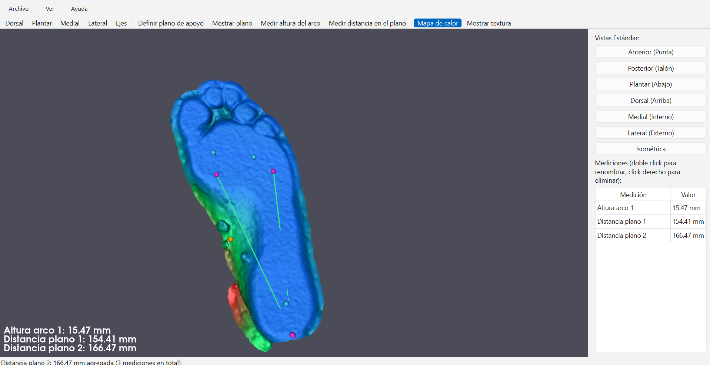

# Pie Viewer — Análisis 3D de la planta del pie

> 🇬🇧 *Desktop app for 3D foot-scan analysis in orthopedics: support-plane definition, arch height measurement, height heat map and PDF reports. Python · PyQt6 · VTK.*

Aplicación de escritorio para visualizar y medir escaneos 3D de pies en carga, pensada para uso en ortopedia. Trabaja con mallas obtenidas con el escáner de luz estructurada **Creality CR-Scan Ferret Pro** y permite definir el plano de apoyo, medir el arco plantar y generar un informe en PDF.

<!-- Reemplazar por una captura con el mapa de calor sobre la planta -->


## Motivación

La evaluación ortopédica del pie suele apoyarse en métodos manuales o en 2D (plantigrafías, podoscopio). Este proyecto propone un flujo digital de bajo costo: escanear el pie apoyado y medir la superficie plantar directamente sobre el modelo 3D, con resultados repetibles y exportables.

## Funcionalidades

**Carga y visualización**
- Importación de mallas **STL** (ASCII y binario) y **OBJ**, con validación de geometría, deduplicación de vértices y advertencias de escala o triángulos degenerados
- Visualización 3D interactiva con VTK: rotación, zoom y paneo
- 7 vistas anatómicas predefinidas: dorsal, plantar, medial, lateral, anterior, posterior e isométrica
- Encuadre automático de cámara al cargar la malla o cambiar de vista

**Medición**
- **Plano de apoyo**: se define con 3 clics sobre la base y se dimensiona según la huella real del pie
- **Altura del arco**: distancia perpendicular desde cualquier punto hasta el plano de apoyo, con múltiples mediciones acumulables
- **Distancias sobre el plano**: ancho y largo de la zona de contacto, proyectadas sobre el plano de apoyo
- **Mapa de calor de altura**: colorea toda la malla según su distancia al plano (azul cerca, rojo en los puntos más altos)
- Previsualización del punto antes de confirmar el clic y tabla de mediciones con eliminación individual

**Exportación**
- Mediciones a **CSV**
- **Informe PDF** con captura de la vista 3D y tabla de mediciones
- **Proyectos** guardables en `.json`: malla, plano y mediciones se reconstruyen al reabrirlos

## Stack

| Capa | Tecnología |
|---|---|
| Interfaz | PyQt6 |
| Render 3D | VTK |
| Geometría | NumPy, SciPy |
| Informes | ReportLab |
| Tests | pytest |

## Arquitectura

```
src/
├── core/
│   ├── mesh_loader.py      # Carga STL/OBJ, validación y deduplicación
│   ├── measurements.py     # Plano de apoyo, alturas y distancias proyectadas
│   ├── project_io.py       # Guardar y abrir proyectos (.json)
│   └── report_export.py    # Exportación a CSV y PDF
├── models/
│   └── foot_model.py       # Modelo de datos: malla, plano y mediciones
├── ui/
│   ├── main_window.py      # Ventana principal, toolbar y tabla de mediciones
│   └── widgets/
│       └── view_3d.py      # Canvas VTK: vistas, picking, mapa de calor
└── main.py
tests/                      # Tests unitarios y de integración
```

Flujo de uso: **abrir malla → definir plano de apoyo → medir → exportar informe**

## Instalación y uso

Requiere Python 3.9 o superior.

```bash
git clone https://github.com/jfbaleztena/pie-viewer.git
cd pie-viewer

python -m venv venv
.\venv\Scripts\activate        # Windows
source venv/bin/activate       # Linux / macOS

pip install -r requirements.txt
python -m src.main
```

## Tests

```bash
python -m pytest tests/ -v
```

72 tests cubren la carga de mallas, el cálculo de mediciones, la persistencia de proyectos y la exportación de informes.

## Próximos pasos

- Datos del paciente en la interfaz y en el informe PDF
- Comparación bilateral (pie izquierdo vs. derecho)
- Tests automatizados de la interfaz

## Autor

**Juan F. Baleztena** — [@jfbaleztena](https://github.com/jfbaleztena)
Ingeniería Electrónica, Universidad Nacional de La Plata (UNLP)

Proyecto desarrollado de punta a punta: relevamiento de requerimientos, arquitectura, implementación y pruebas.
